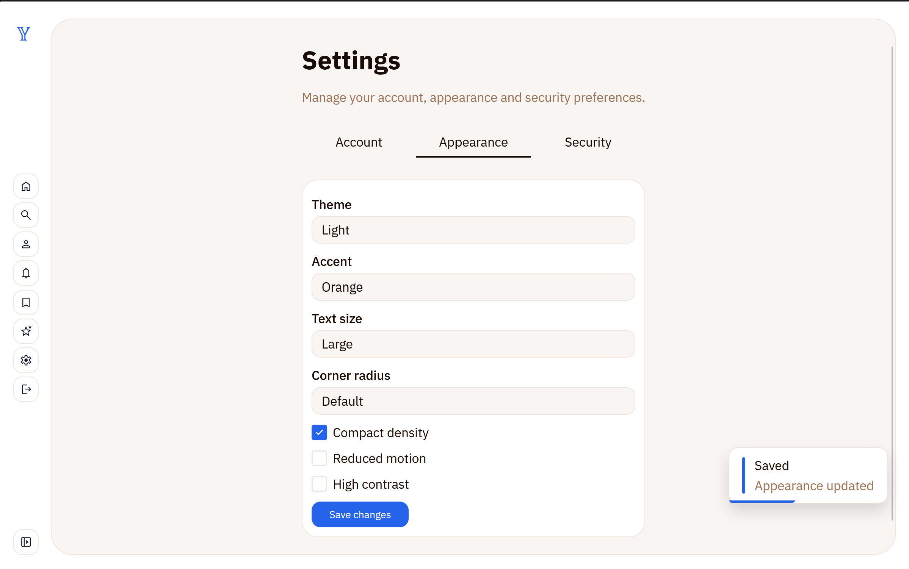
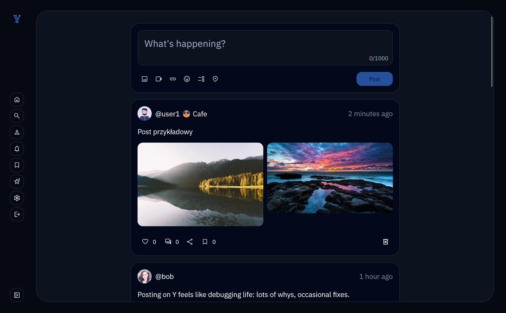
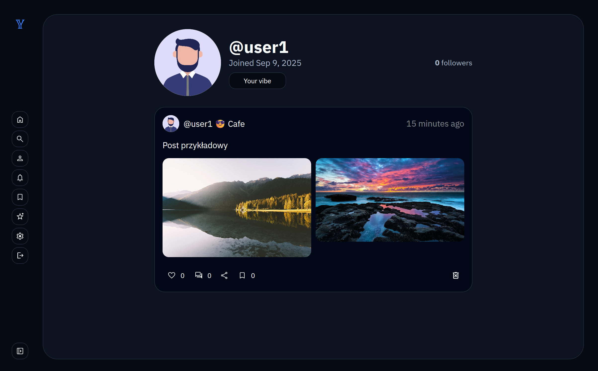
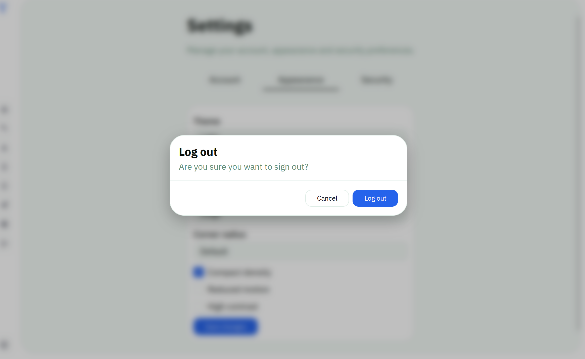
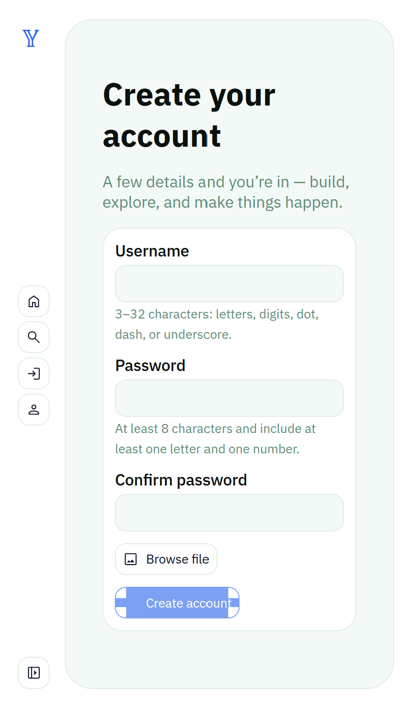
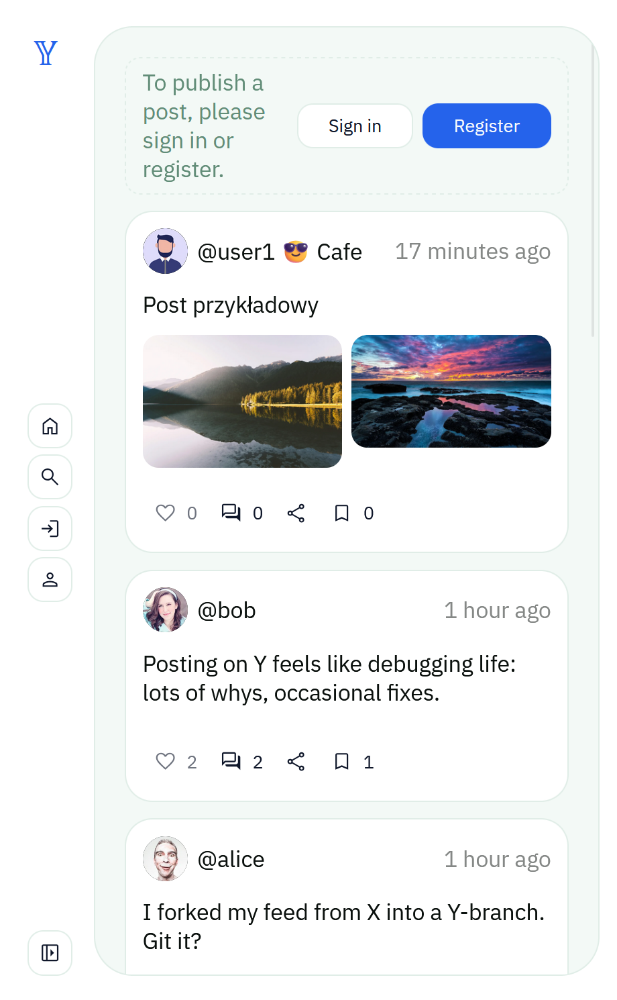
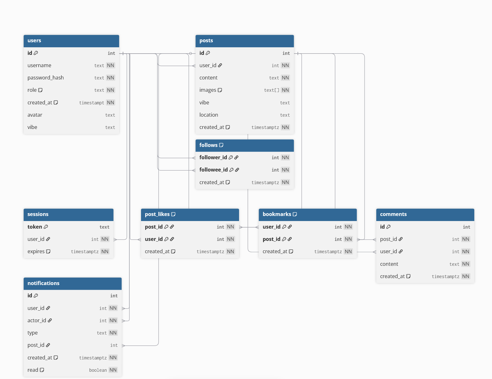

# X clone

Klon X/Twittera z backendem w Node.js (bez frameworków), frontem w Vite (jako pomoc w hot-reload oraz TypeScript) + Web Components oraz bazą PostgreSQL. Aplikacja wspiera logowanie, publikowanie postów (z obrazkami, miejscem i emoji‑vibe), profile użytkowników, polubienia, zakładki, komentarze, obserwowanie, powiadomienia oraz bogate ustawienia wyglądu (tryb jasny/ciemny/system, akcenty kolorystyczne, skala tekstu, promień narożników, gęstość, ograniczenie animacji, wysoki kontrast).

### Dev

```bash
docker compose --profile dev up --build --remove-orphans
```

Aplikacja frontendowa dostępna będzie pod adresem:
[http://localhost:5174](http://localhost:5174)

Backend: [http://localhost:8000](http://localhost:8000)

---

### Prod (Nginx + build dist)
Uruchamia pełny stack w trybie produkcyjnym – frontend budowany i serwowany przez Nginx.

```bash
docker compose --profile normal up --build --remove-orphans
```

Aplikacja frontendowa dostępna będzie pod adresem:
[http://localhost:5173](http://localhost:5173)

Backend: [http://localhost:8000](http://localhost:8000)

---

### Dodatkowe polecenia
Zatrzymanie i usunięcie kontenerów + wolumenów:
```bash
docker compose down -v
```

Czyszczenie nieużywanych wolumenów:
```bash
docker volume prune -f
```

---


## Kluczowe funkcje

- Rejestracja i logowanie z sesją w ciasteczku HttpOnly (7 dni), wylogowanie.
- Posty:
	- Tekst, wiele obrazów (kliencka kompresja i skalowanie), vibe (emoji) i lokalizacja.
	- Polubienia, zakładki, komentarze (zliczanie i lista), udostępnianie linku.
	- Kanał główny oraz feed z osób obserwowanych.
- Profile:
	- Publiczny profil użytkownika (avatar, vibe, statystyki, lista postów).
	- Obserwowanie/odobserwowanie z powiadomieniami.
- Wyszukiwanie: użytkownicy i posty.
- Ustawienia wyglądu:
	- Tryb: system / jasny / ciemny.
	- Akcenty: blue, violet, green, teal, orange, rose (duo motywy usunięte).
	- Skala tekstu, promień narożników, gęstość (compact), ograniczenie animacji, wysoki kontrast.
- Avatar użytkownika: Obraz jest skalowany/wycinany do kwadratu po stronie klienta i zapisywany na serwerze; w bazie przechowywana jest ścieżka do pliku.

## Architektura

- Frontend (Vite + Web Components):
	- Własne znaczniki „y-*” (np. y-button, y-image, y-post, y-emoji-picker, y-popup-select).
	- Globalne zmienne CSS (HSL) i klasy na `:root` (akcenty, tryby, skale, gęstość, wysoki kontrast).
	- Przetwarzanie obrazów po stronie klienta (canvas): posty (max ~1280px), avatar (kwadrat ~256px).
	- Konfiguracja API przez `VITE_API`.
- Backend (Node.js + native http):
	- Routing ręczny, CORS (z ciasteczkami), serializacja JSON.
	- Serwowanie plików uploadowanych (avatarów) spod `/uploads/...` ze stałym cache.
	- Walidacja i ograniczenia (np. rozmiar avataru ~2 MB, tylko formaty obrazów: png/jpg/webp).
- Baza danych (PostgreSQL):
	- Użytkownicy, sesje, posty (z `vibe` i `location`), polubienia, zakładki, komentarze, obserwowanie, powiadomienia.
	- Migracje uruchamiane przy starcie; seed z przykładowymi danymi (bez zewnętrznych avatarów).

## Przepływy

- Rejestracja: nazwa + hasło, opcjonalny upload pliku z avatarem (lokalnie przycinany i zapisywany po stronie serwera).
- Logowanie: weryfikacja hasła; sesja jako cookie HttpOnly.
- Tworzenie posta: tekst + opcjonalne obrazy (kompresja), vibe (emoji) i lokalizacja (chipy z selektorem popup).
- Interakcje: polubienia, zakładki, komentarze (zliczanie, dynamiczne dociąganie listy), udostępnianie linku.
- Profil: avatar (plik), vibe (emoji), obserwowanie; statystyki obserwujących/obserwowanych.
- Ustawienia wyglądu: zmiany stosowane natychmiast poprzez klasy na `document.documentElement` i zapis w localStorage.

## API

- Autoryzacja:
	- POST `/register` — rejestracja (username, password, opcjonalnie avatar jako data URL obrazu).
	- POST `/login` — logowanie; ustawia cookie sesyjne.
	- GET `/me` — dane aktualnego użytkownika (id, username, role, avatar, vibe).
	- POST `/logout` — usunięcie sesji.
	- POST `/settings/avatar` — aktualizacja avatara (data URL obrazu ➜ zapis do `/uploads/avatars/...`).
	- POST `/settings/vibe` — aktualizacja emoji‑vibe.
- Posty i interakcje:
	- GET `/posts` — lista postów.
	- POST `/posts` — utworzenie posta (content, images[], vibe?, location?).
	- DELETE `/posts/:id` — usunięcie (autor/admin).
	- POST `/posts/:id/like` — polub/odlub.
	- POST `/posts/:id/bookmark` — dodaj/usuń zakładkę.
	- GET/POST `/posts/:id/comments` — komentarze (lista/dodanie).
	- GET `/feed` — posty osób obserwowanych (zalogowany).
- Użytkownicy i szukanie:
	- GET `/users/:username` (+ `/posts`) — profil publiczny / posty użytkownika.
	- POST `/users/:username/follow` — obserwuj/odobserwuj.
	- GET `/search/users?q=` oraz `/search/posts?q=`.

	---

	## Podgląd aplikacji

	### Zrzuty ekranu

	
	
	
	
	
	

	### Schemat

	

